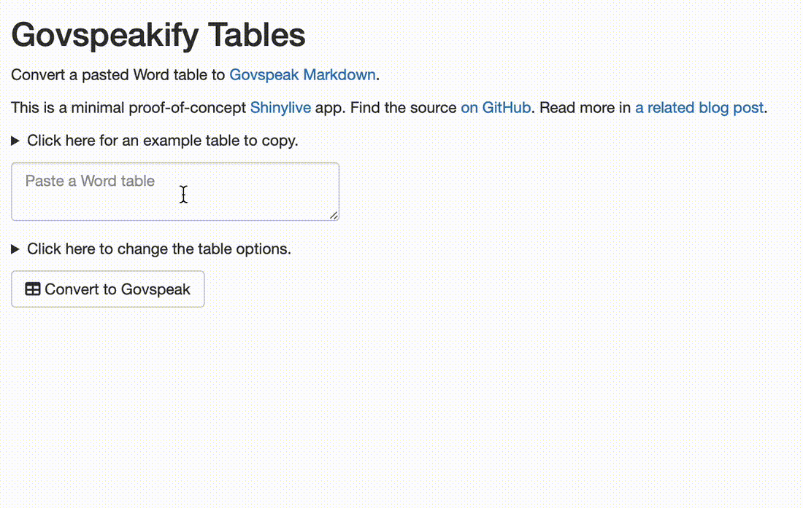

# govspeakify-tables

<!-- badges: start -->

<!-- badges: end -->

A [demo R Shiny app](https://matt-dray.github.io/govspeakify-tables/) to convert a pasted table to [Govspeak Markdown](https://govspeak-preview.publishing.service.gov.uk/guide).

This is a proof-of-concept for [Shinylive](https://posit-dev.github.io/r-shinylive/), which means all the R code is executed within the user's browser without the need for a server. I wrote more about this in [a blog post](https://www.rostrum.blog/posts/2023-10-08-govspeakify-tables/).

